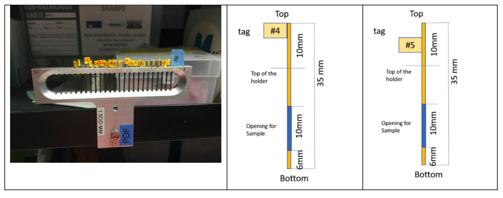

====================
Beamtime Information
====================

Contacts in the Billinge-group
------------------------------
* Beamtime responsible (on-site at experiment): **Simon Billinge (sb2896@columbia.edu)**
* BG contact person (not necessarily on-site at experiment): Your scientific project partner in the Billinge group

Experiment Critical deadlines
-----------------------------
* T0 = first day of the experiment
* T0 - 18 days: Finalize experiment plan with your BG contact person (collaborator)
* T0 - 16 days: fill out Detailed Experiment Plan Google Form (collaborator) 
* T0 - 14 days: send info so BG can submit `Safety Approval form (SAF) to BNL for approval <https://www.bnl.gov/nsls2/userguide/before-arrival.php>`
* T0 - 3 business days : samples received at BNL or by beamtime responsible at Columbia, if they are not being hand-carried by you (see below)
* T0 - 1 day: travel to BNL (only if you are going. Check with Beamtime Responsible whether you need to be there earlier for training etc.)
* T0: start experiment

Checklist for Collaborators
---------------------------
1. **Meet with your contact person in BG to discuss experimental plan**

  * Generate list of all samples including calibration and empty container samples (for background)
  * Temperatures, temperature ranges, special environments
  * What sample holders are needed (glass, Kapton etc. - consider temperature requirements), do you have them available?
  * How do you plan on packaging them for shipping?
  * Will the samples be difficult to prepare in any way? Stickiness, large grain size, only small amounts of powder etc?
  * Where will the samples be sent - BG beamtime responsible or directly to BNL (see below) and when should they be sent?
  
2. **Submit the Detailed Experiment Plan Information using the** `Google Form <https://docs.google.com/forms/d/1YO0F4fKt-Q1qPMsG1md7fAdkfLH0mO42PFLW0-zQi5Y/edit>`_

  * Submit the form once for every individual sample.  This information is used to generate the scan-plans which is why we need one for each sample.
  * Additionally submit the form once for every different background sample, e.g., an empty sample container.
  * If you need multiple different scan plans for the same sample, enter these separately as if they were different samples (ask BG contact for clarification)
  
3. **Prepare the samples in your laboratory.**

  * Check with BG contact for best loading strategy, e.g., temperature appropriate container materials
  * Instructions for loading powder into tubes can be found in `the section on sample preparation`.
  * For each sample holder type (glass, Kapton etc) you will need to include clean and empty holders that can be used for background measurement.  
  * As needed, include spare samples and holders in case of breakage 
  * Label each sample with the sample-name that was entered in the Google Form (don't forget to label the backgrounds!). If you cannot fit a good enough description on the sample itself, use a code on the label and then include a note in the shipping package that links each code to the sample name in the form. See instruction for labeling in `the section on sample preparation`.
  
4. **Take a picture of the samples and their labels**
   
  * Send the picture to your BG contact and the BG experiment responsible
  
5. **Wrap the individual samples in protective material**
   
  * Use bubble wrap/cotton balls or similar for shock absorption to secure the samples
  * If you have glass capillaries inside glass jars, stuff cotton padding around it so it doesn't shake around.
  
6. **Take a picture of all the individually padded/secured samples**

  * Send the picture to your BG contact and the BG experiment responsible
  
7. **Package the samples snuggly in an appropriate box or padded envelope**

8. **Prepare the shipping label.**

  * Samples should be shipped using tracked services such as FedEx.
  * Samples arriving at BNL but not making it to the beamline because of an incomplete shipping label, or arriving too late, are the most common point of failure.  Please pay close attention to the instructions for labeling and shipping samples.
  * Samples can be received at BNL on weekdays (M-F from 9-5).  They must have a BNL designated shipping label that includes the SAF-number (safety approval form) that you should receive from the beamline responsible in the Billinge group.  
  * Using the BNL shipping label and sending directly to the beamline is the preferred way of shipping samples.  However, note that the label is only available after the SAF is approved and this may be delayed if there are any issues with the SAF.  In this case, in order for samples to arrive in time, they can be sent directly to the Beamline Responsible person at Columbia using the following address (only use this address in an emergency and discuss with your BG contact in good time.  Note that they should arrive the day before the Beamline responsible leaves for the experiment.

    | "name of the beamtime responsible"
    | Columbia University
    | APAM department
    | 200 S. W. Mudd Building, MC 4701
    | 500 W 120th St
    | New York, NY 10027

  * Double and triple check the details of the address as packages get lost at BNL and Columbia.  DO NOT GUESS.
  * * If you have any questions or issues, contact the Beamline responsible or your BG group contact 

9. **Take a picture of the finished package with its shipping label.**

10. **Send all three pictures to your BG contact person and beamtime responsible and wait for them to give thumbs up that everything looks alright.**

11. **make sure to follow guidelines for shipping chemicals**

  * If you have MSDS’s, please include them.  
  * If samples are hazardous, follow all rules of the shipping company and BNL for shipping hazardous materials.  MSDS’s are likely required in this case and other packaging rules may have to be followed.

12. **Ship your package!**

Sample prep notes
-----------------

Please watch the following two videos on how to load powder into capillaries.

`Loading samples I: Preparing capillaries <https://www.youtube.com/watch?v=xgl-jkMqSsA>`_

`Loading samples II: Filling capillary <https://www.youtube.com/watch?v=5JBTw4kEXGY>`_

Here, we have some notes for the video:
1. Here are the temperature ranges where different capillary materials can be used

.. list-table:: Title
   :widths: 25 25 50
   :header-rows: 1

   * - Temperature Range
     - Type of sample
     - Description of capillary
   * - 4K - 510K
     - Solid 
     - Kapton tube
   * - 193K - 670K 
     - Liquid 
     - borosilicate NMR tube
   * - 193K - 670K 
     - Solid
     - Liquid borosilicate glass tube
   * - ?K ~ 1373K
     - Solid, Liquid
     - quartz glass tube

1. Standard tube diameter is  1 mm OD (0.0400" OD).  For kapton, get the thinnest wall thickness you can.  For Quartz, there
   is a tradeoff.  Thinner walls scatter less but make the capillaries very brittle and difficult to handle. Because our experiments
   use hard radiation it is often a good tradeoff to go with glass-walled tubes that have slightly thicker walls.

1. For weakly scattering samples we often use 2 mm diameter OD tubes to get more sample in the beam.  Make sure they are not too thin walled
   in this case.  We also use 2 or 3 mm OD NMR tubes even though they have somewhat thick walls.  They are much easier to handle.

1. Kapton tubes can be bought online from several vendors. `This link <https://www.coleparmer.com/i/masterflex-transfer-tubing-polyimide-0-0360-id-x-0-0400-od-12-l-5-pk/9582008>`_ is where to buy the 0.0360" ID x 0.0400" OD, 12"L; 5/PK from cole-parmer.

#. Quartz and/or lower scattering borosilicate capillaries are available from various vendors.  Search for "quartz capillaries for x-ray diffraction".  Some vendors are `Charles Supper <http://www.charles-supper.com/en/page/product.cfm?idProduct=17>`_ or `Hampton Research <https://hamptonresearch.com/product-Quartz-Capillaries-325.html>`_

#. NMR tubes are widely available, e.g., from Sigma Aldrich

#. In the video, the epoxy is used to seal the capillaries. Sticky clay can be used to seal the capillaries as well.

#. A labeled flag can be attached to the top of the capillaries so that it will be easier to identify the sample.

Below, we list the technical standard for the sample loading at 28-ID-1 and 28-ID-2 beamlines:

#. We will be using capillaries only of size (OD) ~ 1 mm (~0.0402”), ~1.2mm (0.0435”), ~1.5mm (~0.0615”), or ~2mm (~0.075”).

#. The capillaries must have the proper length. This depends if it is going in a crysostat/furnace or not.  In the cryostream the tubes can be 3.5 cm or more in length.  Powder must be packed inside the capillary as per the drawing below.

#. Each sample in its capillary should be in one vial/Ziplock pouch/container along with the sample number label

#. Labels should be less than 5mm wide and attached as close as possible on the top side. Place tags at 2 different heights so that samples can be mounted in a consecutive order with alternating tag positions: high, low, high etc.(as shown in the picture) - otherwise labels of adjacent capillaries touch each other.

#. Sample capillaries will be inserted into the multiple sample holder (as show in the picture below). Each holder can hold max 45 including a calibrant on both side (43 + 2).

